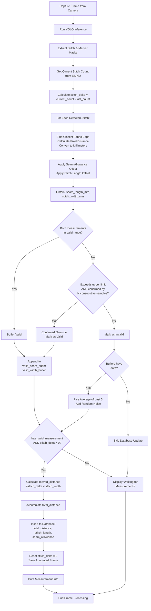
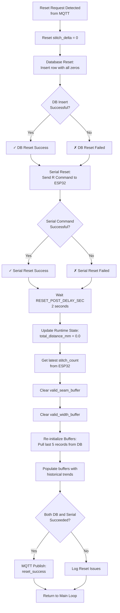
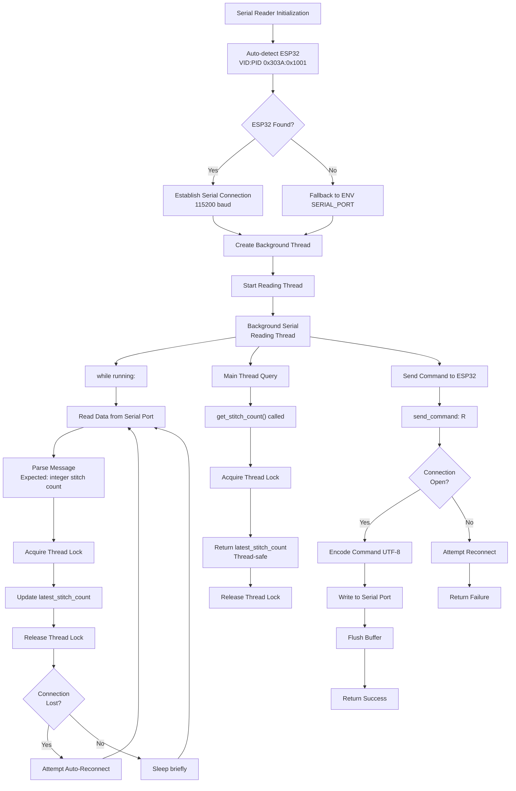
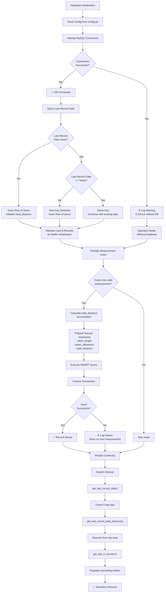
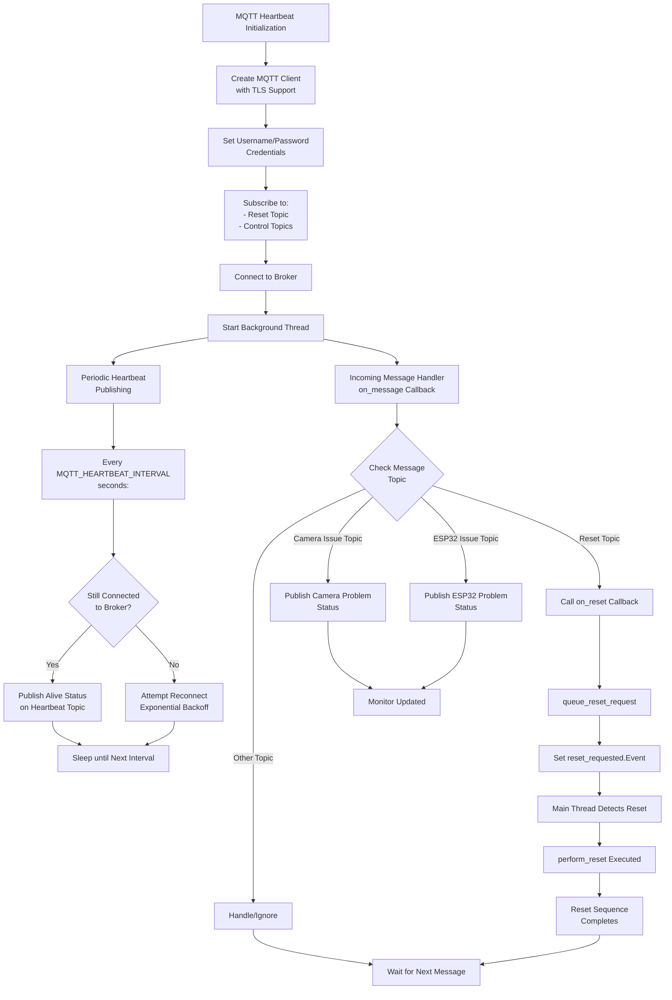

# THREAD - Textile Stitch Measurement System

## Project Overview

**THREAD** (Textile Stitch Measurement System) is an automated computer vision-based fabric inspection system designed to measure stitch quality metrics in real-time during textile manufacturing. The system uses deep learning (YOLOv8 segmentation models) combined with camera calibration and serial communication with ESP32 microcontrollers to accurately measure stitch length and seam allowance.

### Key Features

- **Real-time Stitch Detection**: YOLOv8 segmentation model detects and measures individual stitches
- **Calibrated Measurements**: Uses camera intrinsics/extrinsics and ChArUco board calibration for pixel-to-world-space conversion
- **Serial Integration**: Communicates with ESP32 via serial to get stitch count feedback
- **Database Logging**: Stores measurements in MySQL for historical tracking and analysis
- **MQTT Monitoring**: Publishes heartbeats and status updates to MQTT broker
- **Smart Reset**: Remote reset capability via MQTT topic to reset counters and databases
- **Automated Cleanup**: Background thread cleans up old annotation images based on retention policy

---

## Project Structure

```
THREAD/
├── main.py                          # Main application orchestrator
├── config.py                        # Central configuration file
├── requirements.txt                 # Python dependencies
├── camera_calibration.json          # Camera intrinsic parameters
├── camera_extrinsics.json           # Camera extrinsic parameters (pose)
├── auto_run.sh                      # Auto-start script
├── auto_runner.sh                   # Alternative auto-start script
│
├── Core Modules/
│   ├── measurement.py               # YOLO inference & stitch detection
│   ├── serial_reader.py             # ESP32 serial communication
│   ├── database.py                  # MySQL database operations
│   ├── mqtt_heartbeat.py            # MQTT client & messaging
│   ├── file_cleaner.py              # Background file cleanup thread
│   ├── hardware_utils.py            # Hardware detection utilities
│
├── Utils/                           # Model files & utility scripts
│   ├── best_puller_model.pt         # YOLOv8 stitch detection model
│   ├── testing_model.py             # Model testing utilities
│   ├── usb_camera.py                # USB camera utilities
│   ├── capture_camera.py            # Camera capture utilities
│   └── ...                          # Other model variants
│
├── Other models/                    # Alternative model files
│   ├── best_contrast.pt
│   └── yolov8n_seg_200.pt
│
├── logs/                            # System logs directory
├── saved_annotations/               # Captured frames & measurements
│   └── YYYY-MM-DD_HH-MM-SS/        # Session-specific folders
│
├── scripts/                         # Helper scripts
│   └── grating_passwordless_sudo.sh # Sudo configuration
│
└── docs/                            # Documentation (this folder)
    └── overview.md                  # This file
```

---

## Module Descriptions

### 1. **main.py** - Main Orchestrator
**Purpose**: Central coordinator that manages all components and implements the main measurement loop

**Key Responsibilities**:
- Initialize all modules (measurement app, database, serial reader, MQTT, file cleaner)
- Implement main frame processing loop
- Handle stitch detection, measurement buffering, and smoothing
- Manage database inserts with valid measurements
- Handle reset requests from MQTT
- Graceful shutdown and cleanup

**Key Functions**:
- `main()`: Main application loop
- `perform_reset()`: Reset counters and database on MQTT command
- `reload_camera()`: Reload webcam driver when connection issues occur
- `queue_reset_request()`: MQTT callback to trigger reset

---

### 2. **config.py** - Configuration Management
**Purpose**: Centralized configuration for the entire system

**Configuration Categories**:

#### Camera Calibration
- ChArUco board parameters (marker size, grid dimensions)
- Calibration file paths

#### Camera Settings
- Camera index detection
- Resolution (1280×960)
- Auto-exposure mode

#### YOLO Model
- Model path selection
- Confidence and IOU thresholds
- Class IDs for stitch and marker detection

#### Measurement Thresholds
- Valid measurement ranges (seam: 3.5-7.5mm, stitch: 2.5-4.5mm)
- Outlier filtering parameters
- Measurement offsets for calibration correction

#### Serial Communication
- Port auto-detection (ESP32)
- Baud rate (115200)
- Timeout settings

#### Database
- MySQL connection parameters
- Table configuration

#### MQTT
- Broker connection details
- Heartbeat interval and topics
- Reset topic configuration

---

### 3. **measurement.py** - Computer Vision Processing
**Purpose**: YOLO inference and stitch measurement calculations

**Key Components**:
- **YOLO Model Loader**: Loads pre-trained segmentation model
- **Camera Calibration**: Loads intrinsic/extrinsic matrices
- **Pixel-to-World Conversion**: Converts pixel coordinates to millimeters using camera parameters
- **Stitch Detection**: Identifies stitch and fabric edge markers
- **Measurement Calculation**: Computes stitch width and seam allowance

**Key Methods**:
- `StitchMeasurementApp.process_frame()`: Main inference pipeline
- `pixel_to_world()`: Ray-plane intersection for 3D coordinate conversion
- `marker_far_edge_envelope()`: Identifies fabric edge reference line
- `filtered_mean()`: Robust mean calculation with outlier removal
- `kmeans_1d_two_clusters()`: Clusters stitches into two rows if present

---

### 4. **serial_reader.py** - ESP32 Communication
**Purpose**: Thread-safe serial communication with ESP32 microcontroller

**Key Features**:
- **Background Thread**: Reads stitch count continuously in separate thread
- **Thread Safety**: Uses locks to prevent race conditions
- **Auto-Reconnection**: Attempts to reconnect if connection drops
- **Buffer Management**: Parses serial messages and maintains stitch count

**Key Methods**:
- `start_reading()`: Start background thread
- `get_stitch_count()`: Thread-safe stitch count retrieval
- `send_command()`: Send commands to ESP32 (e.g., "R" for reset)
- `stop()`: Gracefully stop thread

---

### 5. **database.py** - MySQL Storage
**Purpose**: Persistent storage of measurements

**Key Operations**:
- Store measurements: stitch length, seam allowance, total distance
- Query last record date for daily reset detection
- Retrieve last N records for buffer initialization
- Get total distance for continuity after restart

**Key Methods**:
- `insert_measurement()`: Log a new measurement
- `get_last_record_date()`: Check if new day detected
- `get_last_record_total_distance()`: Get running total
- `get_last_n_records()`: Retrieve historical data

---

### 6. **mqtt_heartbeat.py** - Remote Monitoring & Control
**Purpose**: MQTT client for heartbeat publishing and remote control

**Key Features**:
- **Periodic Heartbeat**: Publishes alive status at regular intervals
- **Reset Topic**: Listens for reset commands from broker
- **Status Topics**: Publishes camera/ESP32 issue status
- **TLS Support**: Secure connection to MQTT broker

**Key Methods**:
- `on_message()`: Handle incoming MQTT messages
- `_on_connect()`: Subscribe to control topics
- `publish_reset_success()`: Confirm reset completion

---

### 7. **file_cleaner.py** - Automated Cleanup
**Purpose**: Background maintenance to manage disk space

**Key Features**:
- **Periodic Cleanup**: Runs at configured intervals (every hour)
- **Retention Policy**: Deletes files older than 96 hours (4 days)
- **Recursive Deletion**: Cleans annotation images from session folders
- **Empty Directory Removal**: Removes empty session folders

---

### 8. **hardware_utils.py** - Hardware Detection
**Purpose**: Auto-detect and configure hardware components

**Key Functions**:
- `find_esp32()`: Detect ESP32 via USB VID/PID
- `find_camera()`: Detect available webcam from known device paths

---

## Main Workflow Flowchart

```
┌─────────────────────────────────────────────────────────────────┐
│                    SYSTEM STARTUP                               │
├─────────────────────────────────────────────────────────────────┤
│  1. Load configuration from config.py                           │
│  2. Check calibration files exist                               │
│  3. Initialize StitchMeasurementApp (YOLO + Camera)             │
│  4. Initialize DatabaseHandler                                  │
│  5. Check for new day & reset DB if needed                      │
│  6. Initialize SerialReader (ESP32)                             │
│  7. Initialize FileCleanerThread                                │
│  8. Initialize MqttHeartbeat                                    │
│  9. Pre-populate smoothing buffers from DB                      │
│ 10. Send initial reset to ESP32                                 │
└──────────┬──────────────────────────────────────────────────────┘
           │
           ▼
┌─────────────────────────────────────────────────────────────────┐
│                   MAIN MEASUREMENT LOOP                         │
├─────────────────────────────────────────────────────────────────┤
│  while True:                                                    │
│    Check for MQTT reset request                                 │
│        └─→ If set: perform_reset() [see reset workflow]         │
│    Capture frame from camera                                    │
│        └─→ If failed: attempt reconnection                      │
│    If inference interval elapsed:                               │
│        └─→ Run frame processing [see frame processing workflow] │
│    Display/save annotated frame                                 │
│    Check for 'q' key to quit                                    │
└──────────┬──────────────────────────────────────────────────────┘
           │
           ▼
┌─────────────────────────────────────────────────────────────────┐
│                   GRACEFUL SHUTDOWN                             │
├─────────────────────────────────────────────────────────────────┤
│  1. Stop SerialReader thread                                    │
│  2. Close database connection                                   │
│  3. Stop MQTT client                                            │
│  4. Stop FileCleanerThread                                      │
│  5. Release camera                                              │
│  6. Close all windows                                           │
│  7. Print final stats and session folder path                   │
└─────────────────────────────────────────────────────────────────┘
```

---

## Frame Processing Workflow Flowchart



---

## Reset Workflow Flowchart



---

## Serial Communication Workflow Flowchart



---

## Database Workflow Flowchart



---

## MQTT Control Workflow Flowchart



---

## Data Flow Diagram

```
┌─────────────────────────────────────────────────────────────────┐
│                  HARDWARE LAYER                                  │
├─────────────────────────────────────────────────────────────────┤
│  ┌──────────────┐    ┌──────────────┐    ┌──────────────┐       │
│  │  USB Camera  │    │   ESP32      │    │ MQTT Broker  │       │
│  │ (1280x960)   │    │ (Stitch Cnt) │    │ (Remote Ctrl)│       │
│  └──────┬───────┘    └──────┬───────┘    └──────┬───────┘       │
└─────────┼────────────────────┼─────────────────┼────────────────┘
          │                    │                 │
          ▼                    ▼                 ▼
┌─────────────────────────────────────────────────────────────────┐
│                 SOFTWARE LAYER                                   │
├─────────────────────────────────────────────────────────────────┤
│  ┌──────────────────┐  ┌──────────────────┐  ┌──────────────┐   │
│  │ measurement.py   │  │ serial_reader.py │  │ mqtt_hb.py   │   │
│  │ (YOLO + calib)   │  │ (Thread-safe)    │  │ (Listener)   │   │
│  └────────┬─────────┘  └────────┬─────────┘  └──────┬───────┘   │
│           │                     │                  │             │
│           └─────────────────────┼──────────────────┘             │
│                                 ▼                                │
│                        ┌──────────────────────┐                  │
│                        │     main.py          │                  │
│                        │  (Orchestrator)      │                  │
│                        └─────────┬────────────┘                  │
│                                  ▼                               │
│                        ┌──────────────────────┐                  │
│                        │   database.py        │                  │
│                        │  (MySQL Storage)     │                  │
│                        └──────────────────────┘                  │
│                                                                  │
│                        ┌──────────────────────┐                  │
│                        │  file_cleaner.py     │                  │
│                        │  (Background Cleanup)│                  │
│                        └──────────────────────┘                  │
└─────────────────────────────────────────────────────────────────┘
          │
          ▼
┌─────────────────────────────────────────────────────────────────┐
│                  STORAGE LAYER                                   │
├─────────────────────────────────────────────────────────────────┤
│  ┌──────────────────┐    ┌──────────────────────────────────┐   │
│  │ MySQL Database   │    │ Filesystem (Annotations)         │   │
│  │ - Measurements   │    │ - saved_annotations/             │   │
│  │ - Running totals │    │   └─ SESSION_ID/                 │   │
│  │ - History        │    │      └─ frame_XXXXX.jpg          │   │
│  └──────────────────┘    └──────────────────────────────────┘   │
└─────────────────────────────────────────────────────────────────┘
```

---

## Configuration Parameters Summary

### Key Measurement Limits
| Parameter | Value | Purpose |
|-----------|-------|---------|
| `Seam_upper_limit` | 7.5 mm | Max acceptable seam allowance |
| `Seam_lower_limit` | 3.5 mm | Min acceptable seam allowance |
| `stitch_upper_limit` | 4.5 mm | Max acceptable stitch width |
| `stitch_lower_limit` | 2.5 mm | Min acceptable stitch width |

### Key Offsets
| Parameter | Default | Purpose |
|-----------|---------|---------|
| `STITCH_LENGTH_OFFSET_MM` | -0.3 | Calibration correction for stitch width |
| `SEAM_ALLOWANCE_OFFSET_MM` | 3.5 | Calibration correction for seam |

### Performance Settings
| Parameter | Value | Purpose |
|-----------|-------|---------|
| `INFERENCE_INTERVAL` | 2 seconds | Gap between YOLO inferences |
| `FRAME_BUFFER` | 4 frames | Median filter window |
| `CONFIRM_CONSECUTIVE` | 4 | Consecutive samples to confirm outlier |
| `FILE_RETENTION_HOURS` | 96 hours | Keep files for 4 days |
| `FILE_CLEANUP_INTERVAL_SECONDS` | 3600 | Check cleanup every hour |

---

## Error Handling & Resilience

### Camera Disconnection
- Monitors for failed frame captures
- Retries up to 10 times with 100ms delay
- Reloads webcam driver (`uvcvideo`) on prolonged failure
- Publishes camera issue to MQTT

### Serial Communication
- Automatic port detection via VID/PID
- Connection loss detection and auto-reconnect
- Thread-safe data access with locking
- Graceful fallback if ESP32 unavailable

### Database Failures
- Continues operation without DB if connection fails
- Retries insert on next valid measurement
- Publishes status to MQTT for monitoring

### MQTT Connection Issues
- Auto-reconnect with exponential backoff
- Gracefully continues if broker unavailable
- Reset requests queued and processed on reconnection

---

## Performance Characteristics

- **Frame Processing**: ~2 second interval between inferences
- **Measurement Buffering**: Last 5 valid measurements smoothed
- **Thread Safety**: Locks on serial communication and shared counters
- **Memory**: Circular buffers limited to 5-10 samples each
- **Disk Usage**: ~96 hour retention policy with automatic cleanup

---

## Dependencies

```
numpy               - Numerical computing
opencv-contrib-python - Computer vision & UI
pillow              - Image processing
scipy               - Scientific computing (filtering)
matplotlib          - Visualization (optional)
paho-mqtt           - MQTT client
pyserial            - Serial communication
mysql-connector-python - MySQL access
python-dotenv       - Environment variable management
ultralytics         - YOLOv8 framework
requests            - HTTP library
PyYAML              - YAML parsing
```

---

## Getting Started

1. **Install Dependencies**:
   ```bash
   pip install -r requirements.txt
   ```

2. **Configure Environment** (`.env` file):
   ```
   DB_HOST=localhost
   DB_USER=textile_user
   DB_PASSWORD=secure_password
   DB_DATABASE=stitch_measurements
   DB_TABLE=measurements
   
   MQTT_SERVER=mqtt.example.com
   MQTT_PORT=8883
   MQTT_USERNAME=system_user
   MQTT_PASSWORD=mqtt_password
   
   STITCH_LENGTH_OFFSET_MM=-0.3
   SEAM_ALLOWANCE_OFFSET_MM=3.5
   ```

3. **Calibrate Camera** (if needed):
   - Use ChArUco board calibration app
   - Update `camera_calibration.json` and `camera_extrinsics.json`

4. **Run System**:
   ```bash
   python main.py
   ```

5. **Monitor** via MQTT:
   - Subscribe to heartbeat topic for alive status
   - Send reset command to reset topic
   - Check camera/ESP32 issue topics

---

## Future Enhancements

- [ ] Web dashboard for live monitoring
- [ ] Statistical analysis and trend reporting
- [ ] Multiple camera support
- [ ] Advanced defect classification
- [ ] Machine learning-based threshold optimization
- [ ] Integration with factory MES systems
- [ ] Real-time alerting on quality issues

---

**Last Updated**: May 11, 2026  
**Version**: 1.0
